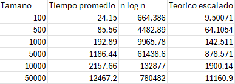
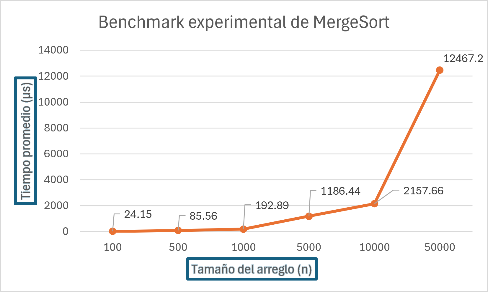
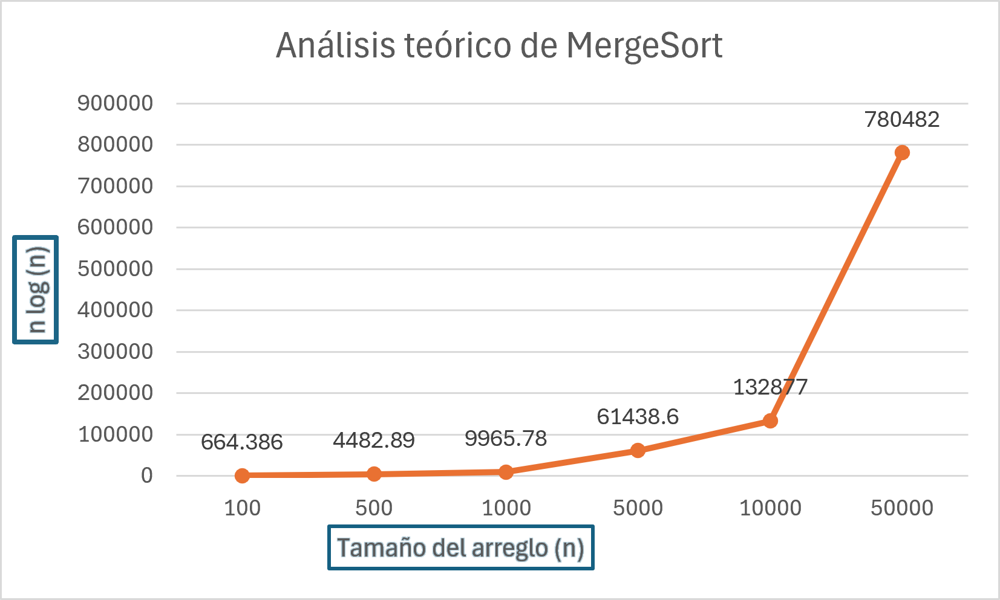
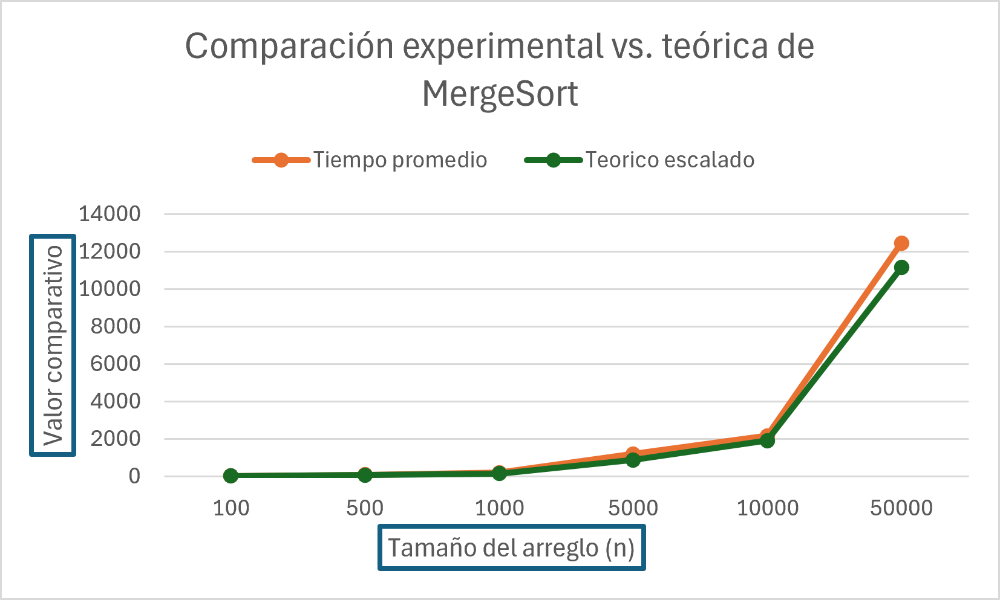

# 1. Benchmark de Búsqueda Binaria

## Objetivo

El objetivo de esta parte del proyecto es comprobar de forma empírica que el algoritmo de Binary Search presenta una complejidad de tiempo de O(log n), para esto se realizaron múltiples ejecuciones del algoritmo utilizando arreglos de diferentes tamaños y valores aleatorios, midiendo el tiempo de ejecución y comparándolo con el crecimiento teórico log n.

## Metodología

Se generaron arreglos de enteros random y se ordenaron antes de medir (el ordenamiento no entra en el tiempo).

Tamaños de n: 1.000 hasta 50.000.000.

Para cada n se hicieron 200.000 búsquedas con objetivos random (existentes y no existentes) y se repitió la medición 5 veces; se reporta el promedio.

Se midió el tiempo promedio por búsqueda (ns) y el número promedio de comparaciones.

La curva teórica se escaló con una constante c: teórico(n) = c · log₂(n).

## Cómo ejecutar (Visual Studio Code)

Primero, se abre una terminal integrada en la carpeta binarySearch. 
Luego, para compilar escriba en la terminal: g++ -O2 -std=c++17 benchmarkBS.cpp -o benchmarkBS
Por último, para ejecutar escriba (esto va a generar resultadosBS.csv): ./benchmarkBS

## Resultados

A continuación, se adjuntan los gráficos con las comparaciones y resultados del benchmark.

(Grafica 1 - tiempo real vs teorico.jpeg)

# 2. Benchmark de MergeSort

## Objetivo

El objetivo de esta parte del proyecto es comprobar de forma empírica que el algoritmo MergeSort presenta una complejidad de tiempo de O(n log n), para esto se realizaron múltiples ejecuciones del algoritmo utilizando arreglos de diferentes tamaños y valores aleatorios, midiendo el tiempo de ejecución y comparándolo con el crecimiento teórico n log n.

## Metodología

Se utilizaron arreglos con los siguientes tamaños:

- 100 , 500 , 1000 , 5000 , 10000 , 50000

Cada arreglo fue llenado con valores aleatorios entre 0 y 99999, para cada tamaño se realizaron 10 ejecuciones de MergeSort y se calculó el tiempo promedio.

El tiempo se midió en microsegundos utilizando `chrono::high_resolution_clock`.

La generación de números aleatorios se realizó antes de iniciar la medición, de manera que únicamente se midiera el tiempo correspondiente al algoritmo MergeSort.

## Resultados experimentales

Los siguientes resultados corresponden al tiempo promedio obtenido para cada tamaño de arreglo probado:

Los resultados obtenidos muestran que el tiempo de ejecución aumenta conforme aumenta el tamaño del arreglo.

## Análisis teórico

La complejidad teórica de MergeSort es O(n log n), esto se debe a que el algoritmo divide repetidamente el arreglo en dos mitades.

La siguiente gráfica muestra el crecimiento teórico de n log n para los mismos tamaños utilizados en el benchmark.

## Comparación experimental vs. teórica

Para comparar visualmente los tiempos experimentales con el crecimiento teórico, se escaló la función n log n mediante una constante.

Este escalamiento no cambia la forma de crecimiento de n log n, sino que permite representar ambas curvas en una escala similar.

Al comparar ambas curvas se observa que presentan una tendencia de crecimiento similar, a medida que aumenta el tamaño del arreglo, el tiempo experimental aumenta de una forma consistente con el comportamiento esperado de n log n.

Por lo tanto, los resultados obtenidos respaldan empíricamente que MergeSort presenta una complejidad de tiempo O(n log n).